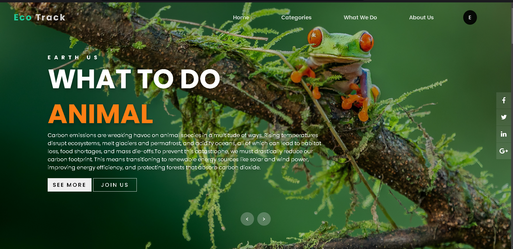

# 🌿 Eco-Tracker React App
<div align="center">
  
</div>
A MERN-based application for tracking and calculating CO₂ emissions from daily activities, helping users understand their carbon footprint and providing actionable recommendations for reduction.
</br>
</br>

<div align="center">
  
  
  
  
</div>

## 🌟 Features

- Calculate CO₂ emissions from daily activities
- Track personal carbon footprint
- Get personalized recommendations for reducing emissions
- User-friendly interface for easy data input
- Visual representation of emission data
- Mobile-responsive design

## 🚀 Getting Started

Clone the repository and install dependencies:

```bash
git clone https://github.com/YogiJi21/Eco-Tracker-React-App.git
cd Eco-Tracker-React-App
npm install
```

Start the development server:

```bash
npm start
```

## 📁 Project Structure

```
Eco-Tracker-React-App/
├── src/
│   ├── components/
│   ├── App.js
│   ├── App.css
│   ├── App.test.js
│   ├── index.js
│   ├── index.css
│   ├── logo.svg
│   ├── reportWebVitals.js
│   ├── setupTests.js
│   └── Tesz.js
├── public/
├── node_modules/
├── package.json
├── package-lock.json
└── README.md
```

## 🛠️ Built With

- [React](https://reactjs.org/) - Frontend framework
- [Node.js](https://nodejs.org/) - Backend runtime
- [Express](https://expressjs.com/) - Backend framework
- [MongoDB](https://www.mongodb.com/) - Database
- [Chart.js](https://www.chartjs.org/) - For data visualization

## 📊 Key Features Explained

### Emissions Calculator
- Calculate emissions from various daily activities
- Track progress over time
- Visual representation of data

### Recommendations
- Personalized suggestions for emission reduction
- Actionable steps for a greener lifestyle
- Progress tracking

## 🚀 GitHub

Visit the application here: [Eco-Tracker App](https://github.com/YogiJi21/Eco-Tracker-React-App.git)

## 📫 Contact

For any questions or suggestions, please reach out to:
- Email: yogi.hingorani21@gmail.com
- LinkedIn: [Yogesh Hingorani](https://linkedin.com/in/yogesh-hingorani21)

---

<div align="center">
  <i>Developed by Yogesh Hingorani</i>
</div>
